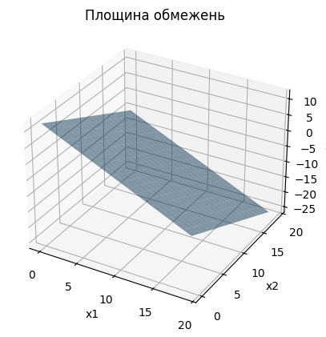
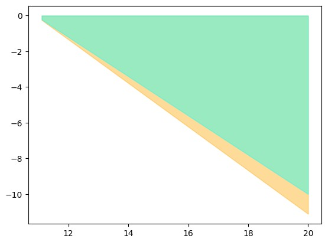
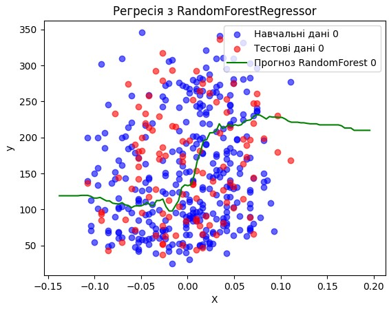
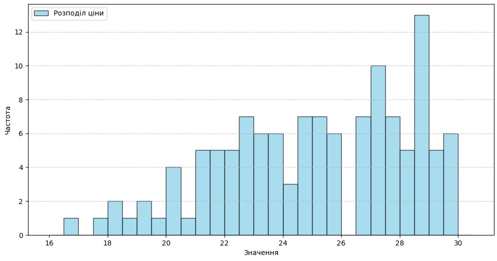
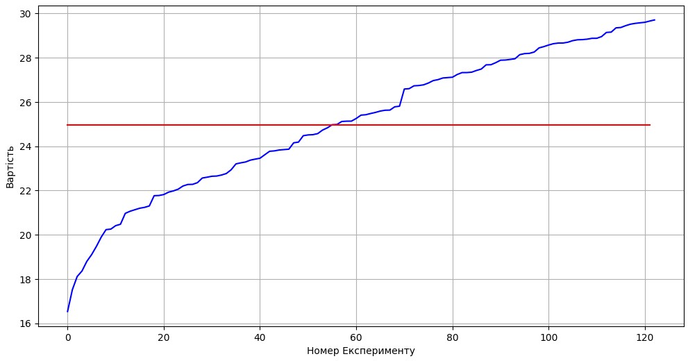
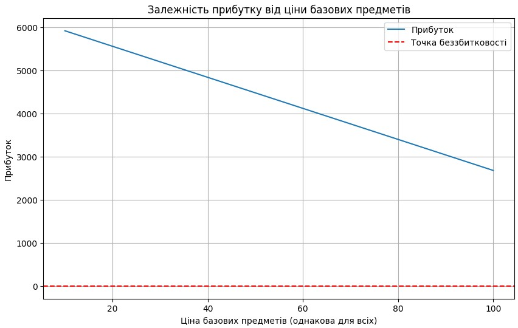

# Звіт до роботи

## Тема: Розвʼязання задач лінійного рограмування

### Мета роботи: Виконати всі завдання та приклади з завдання, лекцій і лабораторних

---

### Виконання роботи

* Результати виконання завдання:
    1. Виконано всі приклади з 1_linear_programming.ipynb;
    2. Виконано всі приклади з 2_sklearn.ipynb;
    3. Виконано всі приклади з ecto.ipynb.

* Скріншоти виконаних завдань:
    ```






    ```

### Висновок:
- :question: Що зроблено в роботі - Виконано всі завдання та приклади з завдання, лекцій і лабораторних.
- :question: Чи досягнуто мети роботи - Так.
- :question: Які нові знання отримано - Те, як розв'язувати задачі лінійного рограмування.
- :question: Чи вдалося відповісти на всі питання, задані в ході роботи - Так.
- :question: Чи вдалося виконати всі завдання - Так.
- :question: Чи виникли складності у виконанні завдання - Ні.
- :question: Чи подобається такий формат здачі роботи (Feedback) - Так.
- :question: Побажання для покращення (Suggestions) - Ні.

---
